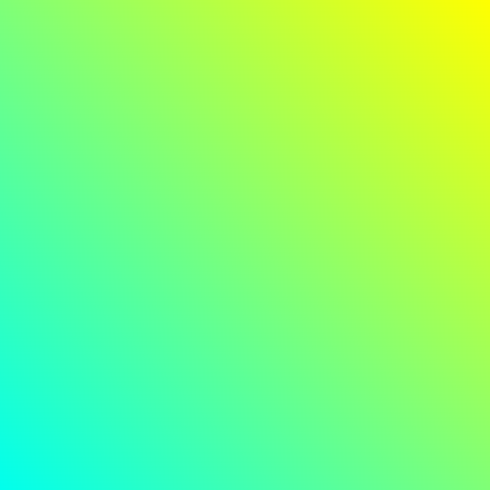
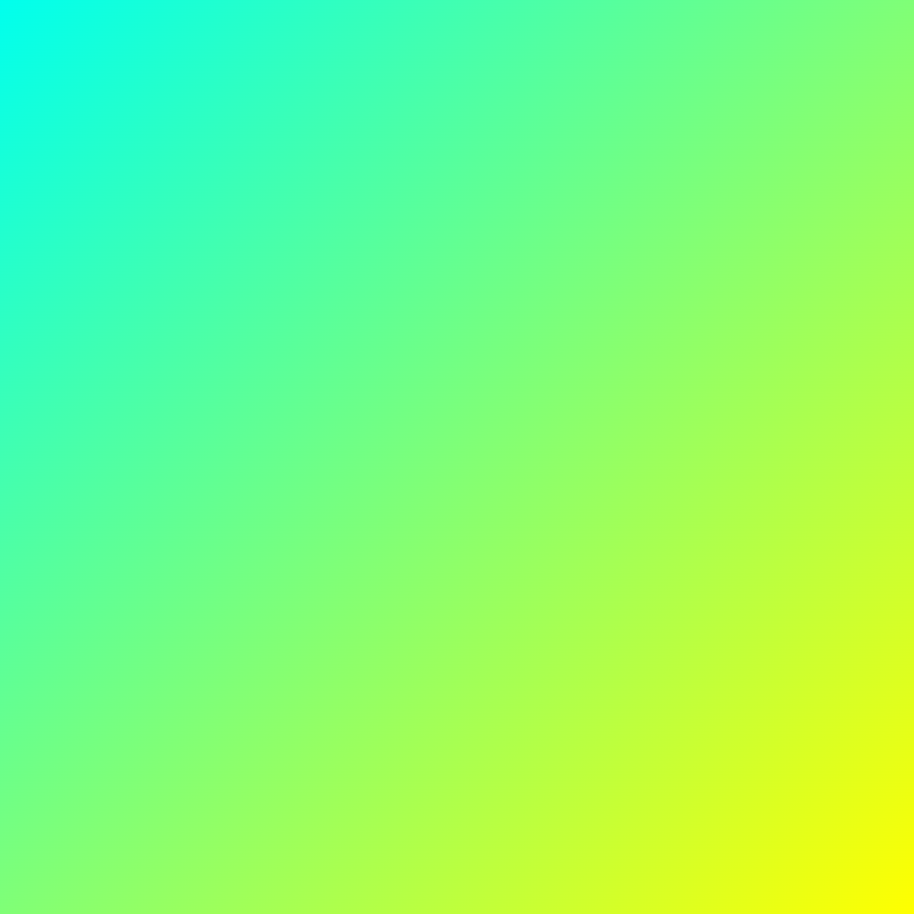

# List of Figures

The following gradient based background images were generated at https://angrytools.com/gradient/image/.

- Alternate storage: [Google Photos](https://photos.app.goo.gl/ohu4g1jnCwD4hCar8) :star:

| SL# | Dimension (HxW) | Preview | Source |
|:---|:---|:---:|:---:|
| `01` | `1200x1200` |  | [:bulb: `Link`][#src-example-3] |
| `02` | `1200x900` |  | [:bulb: `Link`][#src-example-3] |
| `03` | `1200x1200` |  | [:bulb: `Link`][#src-example-3-alt] |
| `04` | `1200x900` |  | [:bulb: `Link`][#src-example-3-alt] |
| `05` | `1200x900` |  | [:bulb: `Link`][#src-example-4] |
| `06` | `1200x900` |  | [:bulb: `Link`][#src-example-4] |
| `07` | `1200x900` |  | [:bulb: `Link`][#src-example-4-alt] |
| `08` | `1200x900` |  | [:bulb: `Link`][#src-example-4-alt] |

<!--- Links --->
[#src-example-3]: https://angrytools.com/gradient/image/?0_ff00df,100_ffff00&0_100,100_100&l_45
[#src-example-3-alt]: https://angrytools.com/gradient/image/?0_ff00df,100_ffff00&0_100,100_100&l_-45
[#src-example-4]: https://angrytools.com/gradient/image/?0_00ffed,100_ffff00&0_100,100_100&l_45
[#src-example-4-alt]: https://angrytools.com/gradient/image/?0_00ffed,100_ffff00&0_100,100_100&l_-45
